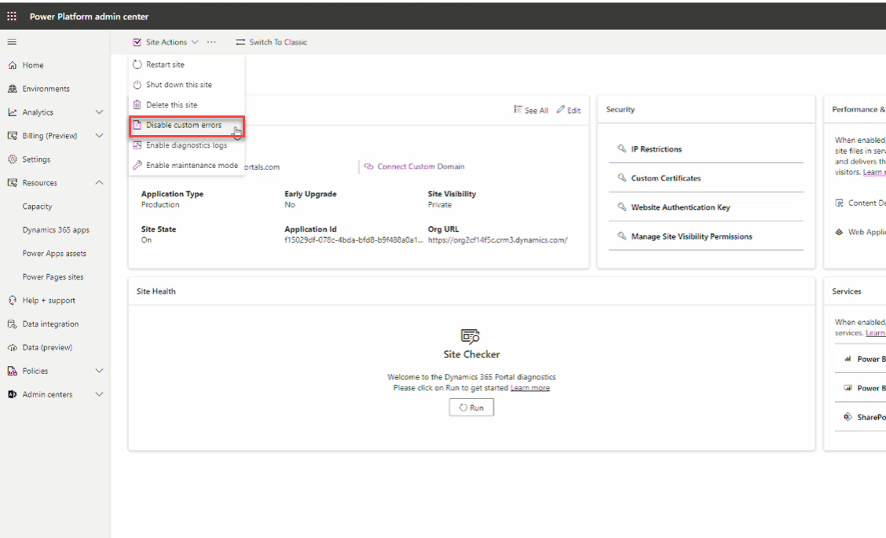

# Power Pages Administration  
Providing functionality in the admin center for managing your Power Pages application and its available features.

## Site Actions  

Power Pages provides several administrative actions to manage your site. These actions are critical for maintenance, troubleshooting, and configuration adjustments.

### Restart Site  
- **Restarts the site without affecting configurations, cache, or data.**  
- **Reboots** the Azure Web Application that is hosting the Portal 
- Useful for applying certain changes or resolving minor issues.  
- Recommended when experiencing minor connectivity problems or authentication issues.  
- The restart process is typically quick and does not require reconfiguration.  

### Reset Site  
- - This action **deletes** the Azure Web App associated with your Portal, and frees up your Portal License
- **Clears the cache and refreshes site settings but does not delete site data.**  
- More extensive than a restart; often required when configuration changes are not taking effect.  
- Can resolve persistent issues related to permissions, metadata sync, or web templates.  
- After a reset, it may take some time for changes to fully propagate.  

### Shut Down This Site  
- Temporarily disables the site without deleting any data.  
- Can be useful for maintenance or cost-saving purposes.  

### Delete This Site  
- Permanently deletes the site and all associated data.  
- **Warning:** This action is irreversible.  

### Disable Custom Errors  
- When dealing with the **White Screen of Death**, disabling custom errors provides more detailed error messages.  
- **Do not disable in production**, as it can expose sensitive information.  
- **Remember to re-enable** custom errors after troubleshooting.  

### Enable Diagnostics Log  
- Allows storing diagnostic logs within an **Azure Storage** account.  
- Helps in debugging and monitoring site issues.  
- **Requires an Azure storage location** to be configured.  

  

## Helpful Links  

- [Site Actions Overview](https://learn.microsoft.com/en-us/power-pages/admin/admin-overview#site-actions)  
- [Restart vs. Reset Explanation](https://www.engineeredcode.com/blog/dynamics-365-portal-restart-vs-reset)  
- [Dealing with White Screen of Death (YouTube)](https://youtu.be/F8QxoyOIzAc)  
- [Diagnostics Log Overview (YouTube)](https://youtu.be/16-M4zTKbds)  
