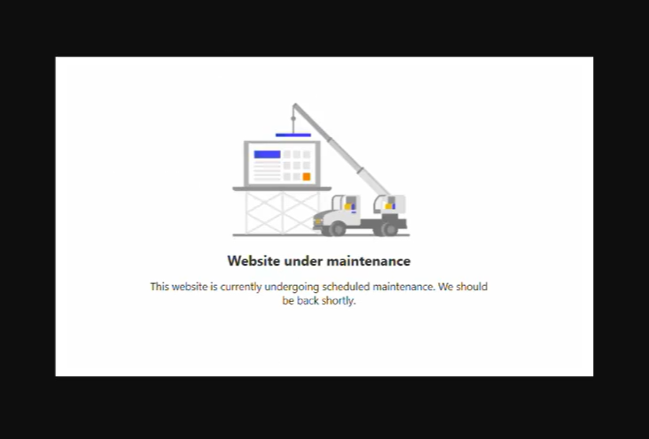

# Maintenance Mode  

When enabled, the site becomes temporarily unavailable.  
Users attempting to log in will be redirected to a maintenance page.  

### Custom Maintenance Page  
- You can configure a **custom HTML page** hosted in **Azure Blob Storage** to display a personalized message.  

### When to Use Maintenance Mode  
- **Dataverse is temporarily unavailable** (e.g., during updates in production).  
- **Applying updates in production** to prevent user disruptions.  
- **Planned maintenance** requiring temporary site downtime.  

### Maintenance Mode Preview  
  

## Helpful Links  
- [Enable Maintenance Mode (Docs)](https://learn.microsoft.com/en-us/power-pages/admin/enable-maintenance-mode)  
- [Maintenance Mode Overview (YouTube)](https://youtu.be/wnmKKQWDVhU)  
