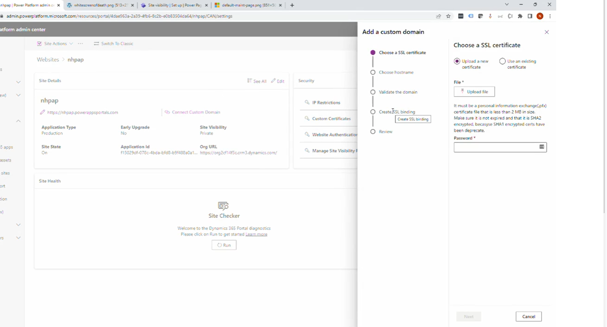

# Custom Domains  

Power Pages allows customers to use their own **custom domain** instead of the default `www.site1.powerappsportals.com`.  

## Setting Up a Custom Domain  

To configure a custom domain, customers must provide:  

### 1. SSL Certificate  
- Must be **signed by a trusted certificate authority (CA)**.  
- Ensures **secure encryption** for data transmission.  
- Must be provided as a **password-protected PFX file**.  

### 2. CNAME DNS Record  
- A **CNAME (Canonical Name) record** must be created in the customer’s DNS settings.  
- This record should point the custom domain to the Power Pages site.  

### Custom Domain Setup Wizard  
  

## Helpful Links  
- [Custom Domain Setup (Docs)](https://learn.microsoft.com/en-us/power-pages/admin/add-custom-domain)  
- [Power Apps Portals Tip #89 - Custom Domain - Engineered Code](https://youtu.be/Wh846EgWbxA)  
- [Power Pages Tip #182 - Azure AD B2C and Changing the Site Domain](https://youtu.be/2S21RcIKDJ0)  
