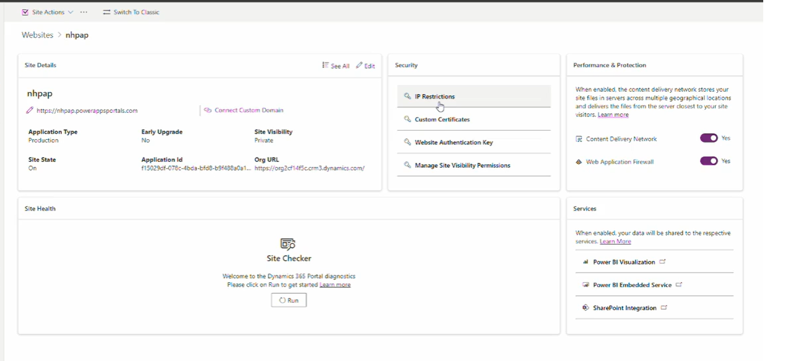

# Security  

The Power Pages Admin Center provides several security features to control access and protect your site.  

## Security Features  

### IP Restriction  
- Restrict access to the site based on specific **IP addresses**.  
- Helps limit access to trusted networks only.  

### Custom Restriction  
- Define additional security policies for site access control.  

### Website Authentication Key  
- Used to **secure API calls** and integrations with external services.  

### Manage Site Visibility & Permissions  
- **Public**: The site is accessible to anyone.  
- **Private**: Only site administrators can log in.  
- **Security Groups**: Assign security groups to control **site administration** and **visibility**.  

### Security Settings Overview  
  

## Helpful Links  

### Video Guides  
- [Power Pages Tip #193 - Controlling Site Visibility](https://www.youtube.com/...)  
- [Power Pages Tip #194 - Site Visibility Permissions](https://www.youtube.com/...)  
- [PowerApps Portals Tip #43 - Restricting Access To A Portal By IP Address](https://www.youtube.com/...)  
- [Power Pages Tip #233 - Anonymous Data Access Governance Setting](https://www.youtube.com/...)  
- [Power Pages Tip #235 - Restrict Access to a Site](https://www.youtube.com/...)  
- [Power Pages Tip #249 - Security Dashboard](https://www.youtube.com/...)  

### Microsoft Documentation  
- [Power Pages Security](https://learn.microsoft.com/...)  
