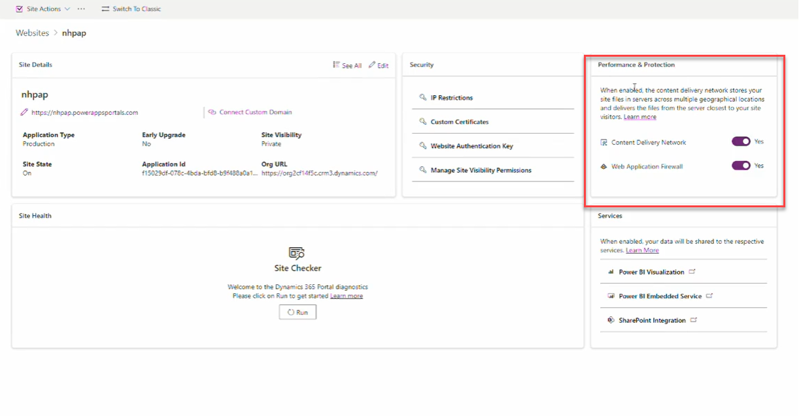

# Performance & Protection  

Power Pages provides tools to enhance site performance and security, ensuring a smooth and protected experience for users.  

## Performance & Security Features  

### Content Delivery Network (CDN)  
A **CDN** improves site speed and performance by caching static content closer to users.  

✅ **When to Use a CDN:**  
When to use caching for static pages
Caching of static pages is recommended in the following scenarios:
- Anonymous users access your site.
- The web page doesn’t contain any dynamic content.
- The site isn't in development.
The following list of actions always serves the pages from the server instead of from the cache:
- An authenticated user accesses any page.
- A maker accesses the site using the Preview button from studio.
- Developer tools are opened and disable cache is checked.
- You select Ctrl+Shift+R (hard refresh).

🚨 **Considerations:**  
- **Only recommended for Production** environments.  
- **CDN caching policies** should be properly configured to avoid outdated content issues.  

### Web Application Firewall (WAF)  
A **WAF** helps protect your Power Pages site from web-based threats like SQL injection, cross-site scripting (XSS), and DDoS attacks.  

✅ **When to Use a WAF:**  
- The Power Pages site **stores or processes sensitive data** (e.g., customer records, financial transactions) and needs protection from cyber threats.  
- Your organization requires **compliance with security regulations** (e.g., GDPR, HIPAA) that mandate strong web security measures.  
- The site is **frequented by users from various networks**, including public Wi-Fi, increasing the risk of malicious activity.  
- There have been **previous security incidents** such as attempted SQL injection, brute-force login attempts, or bot traffic.  

🚨 **Considerations:**  
- WAF should be **configured properly** to avoid blocking legitimate traffic.  
- Monitor **WAF logs and alerts** to detect and respond to potential threats.  

### Performance & Security Overview  
  

## Helpful Links  

### Related Resources  
- [Dynamics 365 Portal: Where to Look When Things Are Slow](https://www.engineeredcode.com/blog/...)  
- [Power Pages Tip #190 - CDN for Power Pages](https://www.youtube.com/...)  
- [Power Pages Tip #191 - WAF for Power Pages](https://www.youtube.com/...)  
- [Power Pages Tip #250 - Analytics Dashboard](https://www.youtube.com/...)  
- [Power Pages Tip #260 - Diagnostics Logs](https://www.youtube.com/...)  

### Microsoft Documentation  
- [Security in Microsoft Power Platform](https://learn.microsoft.com/...)  
- [Security and Governance Considerations](https://learn.microsoft.com/...)  
- [Power Platform Security FAQs](https://learn.microsoft.com/...)  
- [Policies and Communications for Power Platform and Dynamics 365 Services](https://learn.microsoft.com/...)  
- [Configure Web Application Firewall for Power Pages (Preview)](https://learn.microsoft.com/...)  
- [Common Sources of Slow Performance for a Canvas App](https://learn.microsoft.com/...)  
