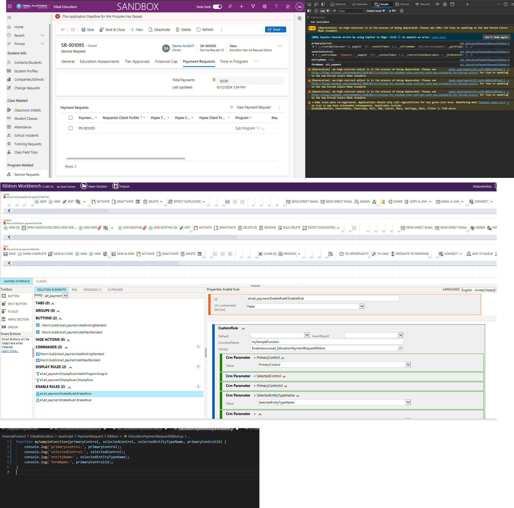

## Customizing Ribbon Buttons Based on Subgrid Context in Dynamics 365

Helpful Links
- https://www.hellosmart.ca/2024/01/customizing-ribbon-buttons-based-on.html

- In the exmaple below, subgrid only load when they are rendered on the form. Ex. you load the form, the ribbon is not yet loaded, until you go to the tab that has the subgrid, then the parameters will be passed

```
// This Function passes the paramaters in the function, and logging them to view
function mySampleFunction(primaryControl, selectedControl, selectedEntityTypeName, primaryControlId) {
    console.log('primaryControl:', primaryControl);
    console.log('selectedControl:', selectedControl);
    console.log('entityName:', selectedEntityTypeName);
    console.log('formName:', primaryControlId);
}

```
